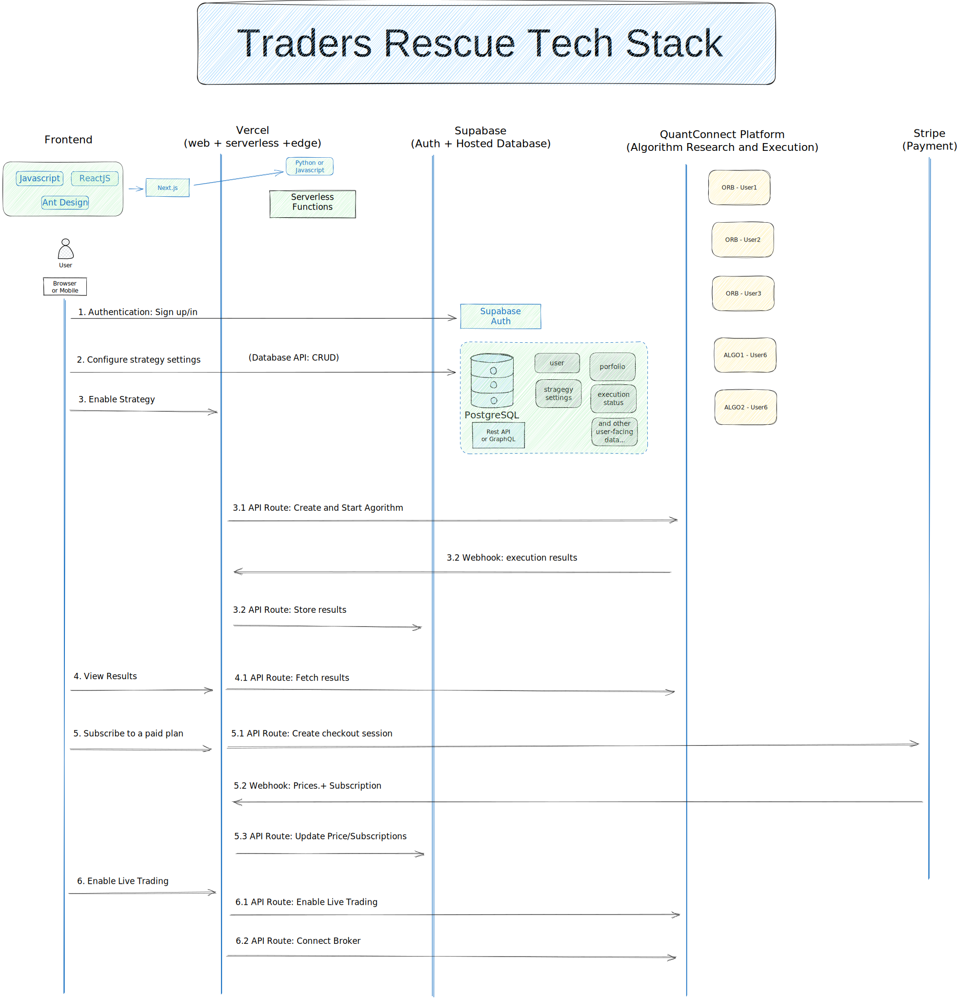

# tr-web

This the web frontend of app.tradersrescue.com

## Features

- This is clone from Vercel [subscription starter](https://vercel.com/templates/next.js/subscription-starter) template
- The original instructions to deploy to Vercel is in [README-vercel.md](README-vercel.md)

## Environment

- Demo - https://app.tradersrescue.com
- Production - https://app-demo.tradersrescue.com


## Architecture



## Develop locally

If you haven't already done so, clone this Github repository to your local machine.

```bash
git clone git@github.com:Traders-Rescue/tr-web.git
```

or 
```bash
git clone https://github.com/Traders-Rescue/tr-web.git
```

### Setting up the env vars locally


```bash
cp .env.local.example .env.local
```

### Use the Stripe CLI to test webhooks (optional)

[Install the Stripe CLI](https://stripe.com/docs/stripe-cli) and [link your Stripe account](https://stripe.com/docs/stripe-cli#login-account).

Next, start local webhook forwarding:

```bash
stripe listen --forward-to=localhost:3000/api/webhooks
```

Running this Stripe command will print a webhook secret (such as, `whsec_***`) to the console. Set `STRIPE_WEBHOOK_SECRET` to this value in your `.env.local` file.

### Install dependencies and run the Next.js client
You'll need to install NodeJS using the same version specified in [.tool-versions](.tool-versions)

In a separate terminal, run the following commands to install dependencies and start the development server:

```bash
npm install
npm run dev
# or
yarn
yarn dev
```

Note that webhook forwarding and the development server must be running concurrently in two separate terminals for the application to work correctly.

Finally, navigate to [http://localhost:3000](http://localhost:3000) in your browser to see the application rendered.


##  Automation test (playwright)

This is document [playwright](https://playwright.dev/)

- Running tests:
You can run your tests with the playwright test command. This will run your tests on all browsers as configured in the playwright.config file. Tests run in headless mode by default meaning no browser window will be opened while running the tests and results will be seen in the terminal.

```bash
pnpm run test:e2e
#or
pnpm test:e2e
```

- Run tests in UI mode:
We highly recommend running your tests with UI Mode for a better developer experience where you can easily walk through each step of the test and visually see what was happening before, during, and after each step. UI mode also comes with many other features such as the locator picker, watch mode and more.

```bash
pnpm run test:ui
#or
pnpm test:ui
```

- Test reports:
The HTML Reporter shows you a full report of your tests allowing you to filter the report by browsers, passed tests, failed tests, skipped tests and flaky tests. By default, the HTML report is opened automatically if some of the tests failed, otherwise you can open it with the following command.

```bash
pnpm run test:report
#or
pnpm test:report
```

You can filter and search for tests as well as click on each test to see the tests errors and explore each step of the test.